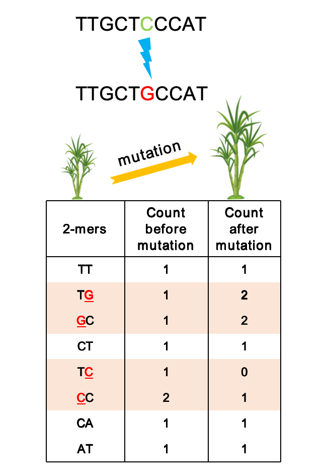

##        KMERIA

### A KMER-based genome-wIde Assocation testing approach on polyploids 




## Overview

 This repository contains a implementation of a kmer-based method for Genome-Wide Assocation Studies(GWAS) in complex polyploid organisms (eg., sugarcane, potato, sweetpotato). The method leverages k-mer abundance and statistical models to identify association loci between genetic variants and phenotypic traits.

## Features


- **Enhanced Genetic Variability Detection:** KMERIA can capture a wider range of genetic variants, including structural variations and copy number variations, which are often overlooked in traditional GWAS.

- **Independent of Reference Genomes:** KMERIA do not rely on a reference genome in steps to identify genotypes, making them suitable for organisms with complex and variable genomic architectures, such as auto-polyploids.

- **Improved Additive effect Estimation:** The analysis of k-mer copy number can provide more accurate estimates of additive effects in auto-polyploid species, allowing for better interpretation of genotype-phenotype relationships.

- **Facilitated Genotype Identification:** KMERIA reduce the complexity of identifying genotypes in polyploids, facilitating faster and more efficient association analyses.


## Prerequisites

- C/C++ compiler
- Linux system

## Installation
   ```bash
   
   Clone the repository:

   git clone https://github.com/Sh1ne111/KMERIA.git
   
   cd KMERIA
   chmod 755 /your_path/KMERIA/bin/*
   chmod 755 /your_path/KMERIA/external_tools/*
   
   #Need to add PATH environment variable
   export PATH=/your_path/KMERIA/bin:/your_path/KMERIA/external_tools:$PATH
   #htslib
   export LD_LIBRARY_PATH=/your_path/KMERIA/lib:$LD_LIBRARY_PATH


   #To avoid the GNU C++ Runtime Library conflicts, you can build conda virtual environments to ensure that dependent libraries are installed
   conda env create -f kmeriaenv.yml
   
   export LD_LIBRARY_PATH=/your_path/kmeriaenv/lib:$LD_LIBRARY_PATH

   conda activate kmeriaenv 
   
```

## Usage

#### 1. kmeria overview

   ```bash
  #--------------------------------------------------------------------------------------#

                  _  ____  __ ______ _____  _____          
                 | |/ /  \/  |  ____|  __ \|_   _|   /\    
                 | ' /| \  / | |__  | |__) | | |    /  \   
                 |  < | |\/| |  __| |  _  /  | |   / /\ \  
                 | . \| |  | | |____| | \ \ _| |_ / ____ \ 
                 |_|\_|_|  |_|______|_|  \_\_____/_/    \_\

Program: KMERIA  [ A KMER-based genome-wIde Assocation testing approach on polyploids ]

Version: v0.0.1

Author: Chen S (chensss1209@gmail.com)

Usage:   kmeria <command> [options]

Command:
           count    Count k-mers from the FASTA/FASTQ files.

           dump     Dump binary k-mers into text format.

           kctm     Build a population-level kmer matrix.

           kctm2    Same function as kctm.

           flt      Filter the raw k-mer matrix.

           m2b      Convert k-mer matrix to the dosage[BIMBAM] format.

           b2g      Convert bimbam to genotype format.

           sketch   Random sampling of k-mers for PCA and kinship calculation.

           asso     Conduct a k-mer association study.

           fr       Fetch reads containing k-mers from the fastq files.

           kbam     Extract reads containing k-mers from a BAM file.

           addp     Add p-values corresponding to significant k-mers to a BAM file.

        #------------------------------------------------------#
        # Please visit the GitHub repository for more details: #
        #       https://github.com/Sh1ne111/KMERIA             #
        #------------------------------------------------------#
#--------------------------------------------------------------------------------------#
```

#### 2.Input Data
Prepare your input data as follows:

- *Genomic sequences: population resequencing data [format: fastq/fastq.gz].**
- *Phenotypic data: tsv format with no headers for traits.**


 #### 3. Step by step usage
Building k-mer count matrices from resequencing reads. First, you need to decide on the k-mer size. In general, the k-mer length should not exceed 31 bp and should be the same for all individuals. We recommend using 31-mers. In addition, the raw data needs to undergo quality control, and the input files should be organized for downstream analysis


#### (1) Count k-mers for each individual separately
```
# kmer counting
kmeria count sample1_r1/r2.fastq.gz -t 4 -o sample1_k31.kc
...
kmeria count sampleN_r1/r2.fastq.gz -t 4 -o sampleN_k31.kc

# dump kmers
kmeria dump sample1_k31.kc -c 5 -C 1000 -o sample1_k31.kc.tsv
...
kmeria dump sampleN_k31.kc -c 5 -C 1000 -o sampleN_k31.kc.tsv

# To accelerate the subsequent construction of the k-mer matrix and save storage space, we recommend to compress the generated k-mer count files.
pigz -p 4 sample1_k31.kmc.tsv
...
pigz -p 4 sampleN_k31.kmc.tsv

- We also support the k-mer counting file using KMC (https://github.com/refresh-bio/KMC)

ls sampleN_*.fastq.gz > sampleN_input.txt
kmc -k31 -t4 -m32 -ci5 -cx1000 @sampleN_input.path sampleN_k31 . 

kmc_tools transform sampleN_k31 dump -s sampleN_k31.kc.tsv
```

To accelerate the subsequent construction of the k-mer matrix and save storage space, we recommend to compress the generated k-mer count files.
```
pigz -p 4 sample1_k31.kmc.tsv
...
pigz -p 4 sampleN_k31.kmc.tsv

```
#### (2) Create the k-mers count matrices at the population level.

```
kmeria kctm -m 50 -c 5 -x 1000  /k-mer_count_path/sample*.kc.gz -o output_prefix

The default output are multiple matrix files with .tsv suffix.

### sample_kmer_matrices_000.tsv
    sample_kmer_matrices_001.tsv
    sample_kmer_matrices_002.tsv
    sample_kmer_matrices_003.tsv
    ...

# Same function as KCTM, but builds the matrix faster. 'kmeria kctm2'

Usage: kmeria kctm2 -i <sample.list> -o <output_prefix>
Options:
    -i <str>   kmer abundance sample list <sample1\nsample2....\nsampleN>
    -o <str>   output prefix
    -h         show usage document

```

After creating the k-mers count, there is no longer a need for separate k-mers count from each individual. Therefore, to save space, all these .kc files can be removed.

#### (3) Invalid k-mers filtration and correction.

```
kmeria flt -i <input_dir>(the directory of previous output) -o <output_dir> \
           -t 8 -c 1000 -s 0.8 -p 6 -d <sample_depth>
```

#### （4）Convert k-mer count matrices to BIMBAM dosage format

```
kmeria m2b --in input_dir --out output_dir --threads 8
```

#### (5) Q + K calculation (population stratification and kinship)

```
# Random sampling of k-mers for PCA and kinship calculation (~0.1% (10,000,000) of total k-mers).

for i in output_dir/*.bimbam
do
 # Total kmers = 20000 * num_chunks
 kmeria sketch -n 20000 $i >> sampling_kmer.bimbam
done

kmeria b2g -i sampling_kmer.bimbam -s <sample_list> -o sampling.geno

```
*b2g* This command is useful, if you want to calculate the PCA and kinship on sampling k-mers 
using external software such as *PLINK* or *GEMMA* program.

```
plink --vcf sampling.geno --make-bed --out sampling.geno
gemma-0.98.5 -bfile sampling.geno -gk -p phenotype.tsv -o kinship

```

#### (6) k-mer-based assocation studies.
```
Usage:  kmeria asso -i|--input bimbam_dir -c|--covar pca.txt -k|--kinship kinship.txt \                  
                      -p|--pheno pheno_table -t|--threads 4 -o|--output output_dir \                                  
                      -n|--ncol 1

#########################################################################################################################
#                                                                                                                       #
#  DESC                                                                                                                 #
#  [basic param]                                                                                                        #
#  Options:                                                                                                             #
#       -h || --help                  Usage document                                                                    #
#       -i || --input                 BIMBAM directory; required                                                        #
#       -c || --covar                 Covariate factor [PCA]; required                                                  #
#       -k || --kinship               Kinship matrix                                                                    #
#       -o || --output                Output directory; required                                                        #
#       -t || --threads               Number of threads [default 8]; optional                                           #
#       -p || --pheno                 Phenotype value,no header, Input format is as follows                             #
#                                                                                                                       #
#                                     e.g: Ind1 101.5 0.25 0                                                            #
#                                          Ind2 102.7 0.23 1                                                            #
#                                          Ind3 101.2 -0.17 1                                                           #
#                                                                                                                       #
#       -n || --ncol                  Phenotype column number                                                           #
#                                                                                                                       #
#  Example                                                                                                              #
#  Usage:  kmeria asso -i|--input <input_dir> -c|--covar <covar_file> -k|--kinship <kinship_matrix> \\                  #
#                      -p|--pheno <pheno_table> -t|--threads [4] -o|--output <output_dir> \\                            #      
#                      -n|--ncol [1]                                                                                    #
#########################################################################################################################
```

#### (7) Post-GWAS analyses.
- KMERIA also provides some post-GWAS analysis options, such as mapping k-mers to a reference genome, finding and mapping the source reads or aligned bams for k-mers, and mapping them to a linear genome or graph-based pangenome.

<Once we found a k -mer that is associated with the phenotype we might want to find the short sequence reads it originated from. To find the reads containing a k -mer of interest you have to do two things. First, you need to find in which accessions/strains the k -mer was present. This can be done using the **kmeria fr** functionality. Then you need to filter the reads and look for reads from the sample of interest and filter the ones that contain your k -mer(s).>

Some functionalities of this tools, please check detail through kmeria program.

#### Blast based method to quickly anchor the genome location of associated k-mers  (naive approach)
```
#Associated kmer results
assoc_file=asso_thres1e-4.txt

#kmer fasta with pvalue
grep -v 'chr' $assoc_file | awk '{printf ">asso_kmer%d_%s\n%s\n", NR-1, $12, $2}' >sigkmer.assoc.fasta

# blast to monoploid genome
blastn -query sigkmer.assoc.fasta -db dbname -out sigkmer.assoc.blastn -evalue 1e-3 -outfmt 6 -num_threads 8

#Remove contig/scaffod
grep -vE '^Chr00|^tig|^scaf' sigkmer.assoc.blastn | awk '!a[$1]++' > sigkmer.assoc.blastn.filter

awk '{print $1"\t"$2"\t"$9"\t"$10}' sigkmer.assoc.blastn.filter|sort -k2,2 -k3,3n > sigkmer.blastn.genome.coord
awk -F '_|\t' '{print $1"_"$2"\t"$4"\t"$5"\t"$3}' sigkmer.blastn.genome.coord > sigkmer.assoc.blastn.plot.txt

```

#### Graph-based pangenome architectures improve physical mapping precision of association-linked k-mers.
```
#Associated kmer results
assoc_file=asso_thres1e-4.txt

#k-mer fasta with P-value
grep -v 'chr' $assoc_file | awk '{printf ">asso_kmer%d_%s\n%s\n", NR-1, $12, $2}' >sigkmer.assoc.fasta

#Extract associated k-mer reads from the fastq file with 'kmeria fr', the P-value is embedded in the output fastq sequence.
kmeria fr Reseq/sample1_r1.fq.gz Reseq/sample1_r2.fq.gz sigkmer.assoc.fasta 31 sample1_sigkmer_asso
kmeria fr Reseq/sample2_r1.fq.gz Reseq/sample2_r2.fq.gz sigkmer.assoc.fasta 31 sample2_sigkmer_asso
...
kmeria fr Reseq/sampleN_r1.fq.gz Reseq/sampleN_r2.fq.gz sigkmer.assoc.fasta 31 sampleN_sigkmer_asso

#Merge all the fastq
cat *_sigkmer_asso_r1.fastq > trait_assoc_r1.fastq
cat *_sigkmer_asso_r2.fastq > trait_assoc_r2.fastq

# Map the associated reads to the graph-based pangenome
minigraph -x sr -t $threads pangenome.gfa trait_assoc_r1.fastq trait_assoc_r2.fastq -o trait_aln.gaf

# Manhattan plot input file generation through standardized text processing of GAF results.

 ```

#### Strategies enable enhanced alignment accuracy to linear monoploid reference genomes through positional constraints derived from association-kmer-linked reads.
```
#Associated kmer results
assoc_file=asso_thres1e-4.txt

#k-mer fasta with P-value
grep -v 'chr' $assoc_file | awk '{printf ">asso_kmer%d_%s\n%s\n", NR-1, $12, $2}' >sigkmer.assoc.fasta

#Extract associated k-mer reads from the fastq file with 'kmeria fr', the P-value is embedded in the output fastq sequence.
kmeria fr Reseq/sample1_r1.fq.gz Reseq/sample1_r2.fq.gz sigkmer.assoc.fasta 31 sample1_sigkmer_asso
kmeria fr Reseq/sample2_r1.fq.gz Reseq/sample2_r2.fq.gz sigkmer.assoc.fasta 31 sample2_sigkmer_asso
...
kmeria fr Reseq/sampleN_r1.fq.gz Reseq/sampleN_r2.fq.gz sigkmer.assoc.fasta 31 sampleN_sigkmer_asso

#Merge all the fastq
cat *_sigkmer_asso_r1.fastq > trait_assoc_r1.fastq
cat *_sigkmer_asso_r2.fastq > trait_assoc_r2.fastq

# Map the associated reads to the linear monoploid genome
minimap2 -x sr -t 32 Ss09_hap1.fa TN_assoc_R1.fastq TN_assoc_R2.fastq -o TN_aln.paf

# Manhattan plot input file generation through standardized text processing of PAF results.

 ```

## License
This project is licensed under the MIT License - see the LICENSE file for details.


## Contact
For questions or feedback, please contact [Chen Shuai] at [chensss1209@gmail.com].


## <span id="citing">Citation</span>

If you have used KMERIA in your research, please cite below:

> https://github.com/Sh1ne111/KMERIA 
  
- Shuai Chen, et al., A novel k-mer-based GWAS approach empowering gene mining in polyploids. (paper preparation)
